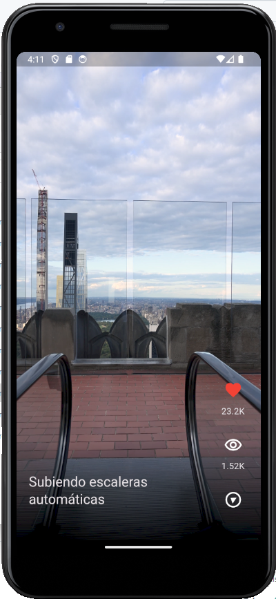
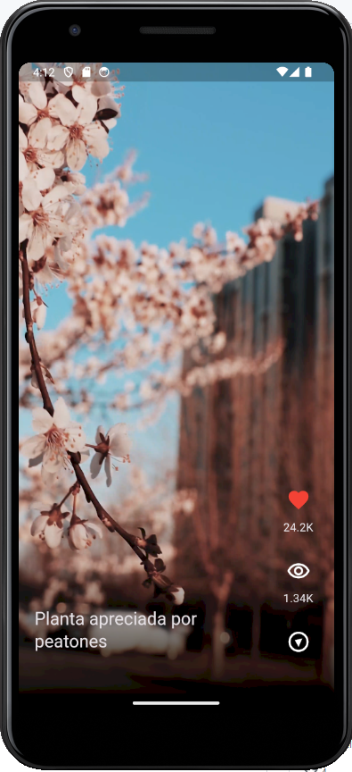
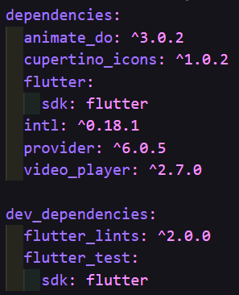

# Flutter TokTik App

Una aplicación de ejemplo de Flutter inspirada en TikTok para compartir y ver videos cortos.

## Características

- **Reproducción de Videos:** Permite a los usuarios ver videos cortos.

- **Pausar Videos:** Los usuarios pueden pausar los videos en cualquier momento al tocar la pantalla.

- **Interacción Social:** Los usuarios disponen de botones de "Me gusta" y contador de visualizaciones.

## Diseño 📱

## Implementaciones 🛠️

* Manejo de assets

* Paquetes

* Gesture Detector

* Posicionamiento de Widgets

* Mappers

* Gradientes

* Loops

* Aserciones

* Stacks

* Controladores de video

* Datasources

* Repositories

## Funcionalidad 🖥️

[videos](https://github.com/jllanas1986/Flutter_TokTik_app/assets/122029674/b2a76608-2be8-4bf5-b8ff-34260cedea3c)

[pausa](https://github.com/jllanas1986/Flutter_TokTik_app/assets/122029674/ddd0defb-d189-4184-9d3a-b633ecc0fe56)

## Dependencias 📜

## Recursos 📚

[Udemy](https://www.udemy.com/)

## Autor ✒️

- **Jose Llanas** - [jllanas1986](https://github.com/jllanas1986)

